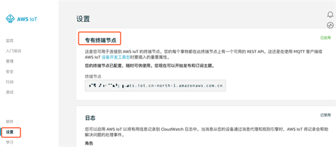
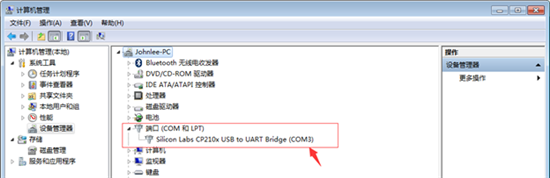
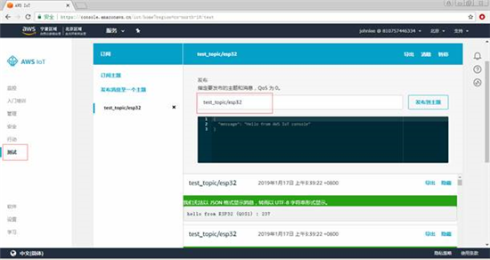
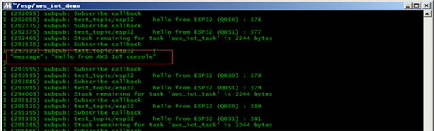

# ESP32连接 AWS IoT 平台并使用GreenGrass

## 背景介绍
在智能家居，可穿戴设备，消费电子产品领域。越来越多的客户需要选择一款具有Wi-Fi功能的MCU或SoC通过连接到云平台对消息进行处理和设备交互与管理。设备如何安全的连接到云平台上是实现物联网的第一步，也是非常重要的一步。
这篇Blog主要介绍如何使用ESP32-DevKit结合乐鑫原生的 ESP-IDF SDK快速安全的链接AWS物联网 (IoT) 应用。

### AWS IoT 服务介绍
AWS IoT 是一种托管的云平台，使互联设备可以轻松安全地与云应用程序及其他设备交互。AWS IoT 可以支持数十亿台设备和数万亿条消息，并且可以对这些消息进行处理并将其安全可靠地路由至 AWS 终端节点和其他设备。

### 乐鑫ESP32介绍
ESP32 是一套 Wi-Fi (2.4 GHz) 和蓝牙 (4.2) 双模解决方案，集成了高性能的 CPU 内核、超低功耗协处理器和丰富的外设。ESP32 采用 40 nm 工艺制成，具有最佳的功耗性能、射频性能、稳定性、通用性和可靠性，适用于各种应用和不同功耗需求。

## 部署方法
1. AWS IoT配置（证书，终端节点）
2. ESP-IDF开发环境搭建
3. ESP32-DevKit USB to VCP Driver驱动安装
4. 配置和使用ESP-IDF创建一个AWS IoT 项目
5. 编译和烧录
6. AWS平台消息测试
---
### 1. AWS IoT 配置  
  #### 1.1  证书生成与下载  
  这一步骤就是在AWS创建一个things，然后生成并下载证书。不再赘述：具体参考[refer](https://docs.aws.amazon.com/zh_cn/iot/latest/developerguide/iot-console-signin.html)，步骤从登录AWS IoT控制台到将证书附加到事物。  
  然后我们会有4个证书。设备证书，公钥，私钥，CA证书（这里CA证书就是我们看到证书内容），对证书需要做以下操作：

  - CA证书保存：  
  将CA证书内容复制并保存为aws-root-ca.pem的文件。

  - 设备证书和私钥：  
  将XXXX-private.pem.key重命名为private.pem.key
  将XXXX-certificate.pem.crt重命名为certificate.pem.crt

  保存好这3个证书，后面我们在烧录固件之前会用到。

  #### 1.2 终端节点  
  终端节点用于设备端连接AWS IoT平台，请记录终端节点。在AWS IoT控制台的设置中找到。
    
### 2. ESP-IDF开发环境搭建  
我们下面开始ESP-IDF开发环境的搭建，需要准备如下：  
- 工具链：用于编译ESP32应用程序。
- ESP-IDF：包含ESP32 API和用于操作工具链的脚本。
- 编译器：编写C语言的程序。
- ESP32开发板  
  #### 2.1 Windows安装工具链（Toolchain）  
  下载Toolchain for Windows，[DownloadLink](https://dl.espressif.com/dl/esp32_win32_msys2_environment_and_toolchain-20181001.zip)。将 zip 压缩文件解压到 C:\，它会使用预先准备的环境创建一个 msys32 目录。运行 C:\msys32\mingw32.exe 打开一个 MSYS2 的终端窗口。该窗口的环境是一个 bash shell。创建一个 esp 目录作为开发 ESP32 应用的默认地址，运行命令：`mkdir -p ~/esp`  
  #### 2.2 为 ESP32 设置开发环境ESP-IDF  
  先进入到esp目录下，然后通过GitHub获取，运行命令，大概5分钟左右（取决于你的网速），运行命令：
  ```shell
  cd ~/esp  
  git clone -b release/v3.2 --recursive https://github.com/espressif/esp-idf.git
  ```  
  #### 2.3 工具链程序使用环境变量   
  IDF_PATH 来访问 ESP-IDF。将用户配置文件脚本存放在 C:/msys32/etc/profile.d/ 目录中。目的是每次打开 MSYS2 窗口时，系统都执行这些脚本。
  - 在 C:/msys32/etc/profile.d/ 目录下创建一个新的脚本文件。将其命名为 export_idf_path.sh。
  - 确定 ESP-IDF 目录的路径。路径与系统配置有关，例如 C:\msys32\home\user-name\esp\esp-idf。
  - 在脚本中文件export_idf_path.sh加入 export 命令，例如:`export IDF_PATH="C:/msys32/home/user-name/esp/esp-idf"`  
  保存脚本。关闭 MSYS2 窗口并再次打开。输入以下命令检查是否设置了 IDF_PATH:`printenv IDF_PATH`  
  #### 2.4 安装Python依赖包  
  ESP-IDF 所依赖的 Python 软件包位于 $IDF_PATH/requirements.txt 文件中，您可以通过运行以下命令来安装它们：`python -m pip install --user -r $IDF_PATH/requirements.txt`  
### 3. ESP32-DevKit USB to VCP Driver驱动安装  
在创建AWS IoT项目之前我们需要确认ESP32的CP210X USB to VCP Driver是否安装。如果没有，请安装：[link](https://www.silabs.com/products/development-tools/software/usb-to-uart-bridge-vcp-drivers)，当然 你的ESP32也有可能是CH340或者其他Driver，请自行安装驱动。安装成功后，我们将开发版的接入到计算机，通过设备管理器可以看到COM3：  

### 4. 配置和使用ESP-IDF创建一个AWS IoT 项目，方法如下：  
- 示例项目aws_iot_demo
- 串口配置
- endpoint设置
- WIFI与IoT Client ID设置  
  #### 4.1 复制subscribe_publish项目到esp目录并重命名为aws_iot_demo，subscribe_publish所在目录在：  
  C:\msys32\home\user-name\esp\esp-idf\examples\protocols\aws_iot\subscribe_publish  
  将Esp32连接电脑，回到MSYS2命令界面到aws_iot_demo目录下:  
  `cd ~/esp/aws_iot_demo/`  
  输入命令进入配置界面：  
  `make menuconfig`  
  PS：第一次运行需要反映5-10秒钟的时间，不要关闭命令窗口。  
  #### 4.2 串口配置  
  在菜单中，进入 Serial flasher config > Default serial port 配置串口（工程将会加载到该串口上）。输入自己的串口名称并回车确认选择，选择 < Save > 保存配置，然后选择 < Exit > 退出应用程序。比如我的是COM3，就输入COM3。  
  #### 4.3 下一步我们来做AWS IoT Endpoint Hostname设置  
  Componet config > Amazon Web Service IoT Platform >复制aws iot endpoint 并保存（在步骤1.2保存的终端节点URL）。  
  #### 4.4 然后做WIFI与IoT Client ID的配置  
  在Example Configuration设置有效的WiFi SSID，WiFi Password与AWS IoT Client ID。
  #### 4.5 为了监控，我们还有设置一个频率  
  进入Component config > ESP32-specific，设置Main XTAL frequency为26MHz。  
  #### 4.6 保存并退出到命令界面后需要等待一下完成配置  
### 5. 编译和烧录：  
在烧录程序之前将以下证书，private.pem.key，certificate.pem.crt，aws-root-ca.pem （步骤1.1）复制到C:\msys32\home\user-name\esp\aws_iot_demo\main\certs中（替换掉已有的aws-root-ca.pem）  
cd 到 aws_iot_demo的目录下运行`make flash` 。  
在界面上出现Connecting…字样时候（ESP32 led信号灯闪）按住boot或FLASH按钮（ESP的开发板右下角有一个BOOT或FLASH的按键），等到出现烧录的时候就可以松开了。  
烧录成功后通过make monitor命令来查看 “aws_iot_demo” 程序是否真的在运行,并是否成功打印消息。比如建立握手和连接的过程以及消息的打印。  
### 6. AWS平台消息测试  
回到AWS IoT的控制台中，选择测试，订阅主题：test_topic/esp32，控制台下方会显示ESP32发送过来的消息：  
  
也可以推送一个消息到ESP32，编辑或使用默认消息：  
  
回到MSYS2命令窗口，会收到一个message为Hello from AWS IoT console.
  
### 7. AWS GreenGrass结合  
  #### 7.1 在 AWS IoT Core 控制台中，依次选择 Greengrass、组，然后选择您的组。  
  #### 7.2 在组配置页面中，选择设备，然后选择添加设备。  
  #### 7.3 选择 Select an IoT Thing。选择之前创建的Thing并完成添加。  
  #### 7.4 之后的内容请参考[AWS IOT LAB by Xilinx](https://github.com/xupsh/PYNQ_GreenGrass)完成GreenGrass结合。  
  **请注意作为device的thing其证书仍然用创建Thing时所下载的证书即可**  
## 参考文献  
[通过乐鑫原生 SDK-ESP IDF 连接 AWS IoT 平台](https://aws.amazon.com/cn/blogs/china/sdk-esp-idf-aws-iot-connection/)  
[AWS IOT LAB by Xilinx](https://github.com/xupsh/PYNQ_GreenGrass)
